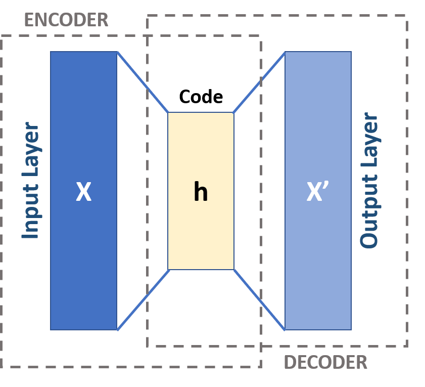

# Embeddings for the Rest of Us

## Introduction

This chapter provides an introduction to geospatial embeddings. We will cover _what_ they are, _how_ they work, and _why_ they have become so popular in the last few years. Because this is the Book of Imagery, we will focus on embeddings for satellite imagery. However, much of what we will discuss applies to other types of embeddings, such as those from text or other forms of geospatial data. The principles are very similar; the details can differ more. Also, in the spirit of this book, we will offer a perspective that is hopefully more attuned to the frameworks social scientists and less technical folks have in mind. 

Although the word "embedding" has been a staple of statistical and machine learning parlance for a long time, its appearance in the mainstream is much more recent. All of a sudden, everyone is talking about embeddings. Word embeddings, embedding-based search engines, geospatial embeddings. Whenever a term becomes so widespread so quickly, the bit of knowledge it refers to both expands a little and also changes some. And so it becomes much more difficult to provide an accurate and full account of its meaning. We will not try to do so here. Instead, we will focus on two aspects: the _intuition_ behind what an embedding is, where it comes from, and how it is built; and the _relevance_ of embeddings in applied contexts, particularly for those working in social research and policy. A final disclaimer: this is a very rapidly moving field and, by the time you read this, some of what follows may be partially obsolete. We focus on fundamentals and core ideas precisely to minimise this risk, but even some of those may change. Consider yourself warned.

We have structured the chapter to build from the core ideas out to their current relevance. @sec-embeddings_what provides a conceptual overview of where embeddings came from and what they are. This part will feel a bit abstract and detached from any applications you as a social researcher or policy maker may be interested in. This is on purpose and, if you have a bit of faith, it will prove useful later on. @sec-embeddings_why makes the case for why embeddings, as described in the previous section, should be interesting to you. @sec-embeddings_product introduces the Imago embeddings data product and frames it against everything you will have read by then. And we wrap up the chapter with @sec-embeddings_conclusion. 

## What are (satellite) embeddings? {#sec-embeddings_what}

### Autoencoders: an old idea whose time has come

To understand the embeddings of today, one needs to learn about the autoencoders of the 1980s. Autoencoders are a type of self-supervised neural network that emerged in the latter part of the decade and beginning of the next one [e.g., @bourlard1988autoassociation; @baldi1989neural; @kramer1991nonlinear]. Since then, they have evolved greatly, and their variations have widened considerably. Their fundamentals, however, have remained rather consistent, and these are the important part for us in this chapter. 

All the core building blocks of an autoencoder are represented in @fig-autoencoder_schema. At its most fundamental, an autoencoder has three parts: the encoder, the code (or latent representation, $h$), and the decoder. The _encoder_ takes the input data ($X$ in the figure; e.g., image) and, through a series of mathematical transformations, turns it into $h$, a vector of smaller dimensionality. For example, think of an image that is 256 pixels wide, 256 pixels high and has three bands (e.g., red, green, and blue) for every pixel[^1]. This means that the image is made up of $256 \times 256 \times 3 = 196{,}608$ single values. In most applications, $h$ is of much smaller dimension (e.g., 128). The _decoder_ begins with the latent representation and turns it into an output ($X'$) of the same dimension as the input data. In our example, it takes a vector of the dimension of $h$ (e.g., 128 values) and converts it into an array of $256 \times 256 \times 3$ values. Once an autoencoder is trained, the encoder is typically the most useful part, but you cannot train an encoder without a decoder. 

If this were a more mathematically savvy chapter, we would spend much more time discussing the structure, properties, and neat tricks that the literature has proposed for encoders and decoders (many of the advances over the last 40 years are indeed in this area). Since this is not the case, it will suffice to say both components are made up of mathematical transformations that take the required input and deliver, at their respective ends, vectors or arrays of the expected shapes. Crucially, both the encoder and the decoder are "trainable": they contain parameters (weights) that can be tuned with data to minimise an objective function. In fact, when we "train" an autoencoder, we show it a bunch of data so that it can tune its weights in a way that makes the output of the decoder _as similar as possible_ to the input of the encoder. 

[^1]: An image is really a large matrix of small pixels (or tiny squares), each of them of a single colour. Since every colour in the spectrum can be made up of a combination of red, green, and blue, an image can be mathematically represented as a three dimensional matrix, or array, with pixels along width and height, and three values (red, green, blue) assigned to each pixel to represent its colour.

::: {#fig-autoencoder_schema}
{width="500" fig-alt="Diagram of an autoencoder: an input layer X feeds an encoder that narrows into a small code h, which feeds a decoder that widens back out into an output layer X' of the same size as the input."}

**Schematic representation of an autoencoder**. *Source: [Michela Massi](https://commons.wikimedia.org/wiki/File:Autoencoder_schema.png), [CC BY-SA 4.0](https://creativecommons.org/licenses/by-sa/4.0/), via Wikimedia Commons.*
:::

An autoencoder is thus a series of transformations that can take an image (expressed as an array of numbers) and turn it into another one that looks similar. Think of it as a series of pipes, filters, and splitters that take a bucket (structured array) of water (data) from the original bucket to another one that looks alike. But, _why?_ What is the point of this exercise in mathematical gymnastics?

In our context[^2], autoencoders are useful because, through the process of encoding, they distil the "statistical essence" of an image into a dense and compressed version. Instead of working with a complex and cumbersome $256 \times 256 \times 3$ data array, you can use a simple sequence of 128 numbers that, together, capture most properties engraved in the original image. In statistics, this process is called _dimensionality reduction_, and is one of the areas autoencoders excel at.
Note also that, although this process happens in the encoder part, the decoder is just as important to make it all happen. It is only through the decoder that an autoencoder can take a latent representation ($h$) and turn it back into an output that can be directly compared to the input. This is the way the autoencoder knows how good $h$ is and is a crucial step in training. And this is the other "killer app" of autoencoders: they are _self-supervised_, meaning that they can be trained with a goal (reconstructing the input as accurately as possible) without requiring additional information in the form of labels. Self-supervision is a neat trick that sits between the more traditional unsupervised and supervised types of machine learning. Keep this bit in mind as you read through, we will return to it later when we discuss why autoencoders (and embeddings) are so popular today.

[^2]: Autoencoders are used in a variety of fields for many purposes, so our treatment here is unavoidably reductionist. 

There are two more aspects of autoencoders worth highlighting to social researchers. The first is flexibility. Note how, in our account of how they work, we have not put any constraint on the shape of the input data. We have worked with the example of an image; but any type of data that can be represented as a structured array (and _most_ data we are interested in in the social sciences _can_ be represented this way) is fair game for an autoencoder. Think of very large and wide tables of Census data, or transcripts of interviews that are converted into word frequency tables, or even panel data of several dimensions. These are all structures an autoencoder can be designed for. The second is that, although there is a lot of fancy maths and other magic involved here, the core purpose of what we have described is not foreign to social scientists. Data reduction has been a trick in our bag for a long time. Think of principal components analysis [PCA, @jolliffe2002principal], a widely used approach to turn long lists of variables into a smaller, more compressed, version that is easier to work with. In essence, an autoencoder is doing a very similar thing to PCA. The main difference is that autoencoders do not impose the constraint of linearity that PCA does. Relying on linear transformations makes PCA extremely efficient (you can use it effectively in small datasets), but only at the cost of flexibility and performance. Using PCA made more sense 50 years ago, when computing power was limited and datasets small. In an age when computers are much more powerful and datasets orders of magnitude bigger, an approach like autoencoders starts looking more compelling.

### From autoencoders to modern embeddings

Autoencoders have changed a lot since the early proposals of the 1980s and 1990s. Since this is not an exhaustive historical review, we will skip most of that progress here. However, at least two points in time are worth considering to understand where satellite embeddings are today: the decade of the 2010s, and the current moment we find ourselves at in the middle of the 2020s.

In the 2010s, computer vision was revolutionised. A series of technological advances converged with algorithm development and refinement of decades-old ideas to produce a new class of models that effectively "solved" vision. Much of this progress relied on deep learning [@lecun2015deep], a subfield that developed "deeper" neural networks, networks with more layers in between the input and the output. For most of this decade, the main workhorse of these approaches was convolutional neural networks [CNNs, e.g., @lecun1998gradient; @krizhevsky2012imagenet], a class of networks that work particularly well with images. Autoencoders also benefitted from many of these advances, and convolutional autoencoders emerged as a significant step forward when working with images. Nevertheless, the most popular approach of the decade, and the main application of CNNs, was in supervised networks that predicted a set of labels of interest. This proved to work exceptionally well, once trained. However, the training process was computationally demanding, very data hungry, and hard to "recycle" for different applications. Training a CNN was thus an (expensive) sunk cost that forced you to consider carefully whether it was worth the effort.

Towards the end of the decade, deep learning saw a second inflection point. A paper [@vaswani2017attention] focusing on text rather than images proposed the transformer, a new type of network architecture that would usher in the next generation of models[^3] and, in the early years of the next decade, transformers moved to images as well [@dosovitskiy2021image]. The transformer was part of a series of innovations that moved the field from supervised neural networks, where the network was trained for a specific set of labels and transferability was limited[^4], to what we today call _foundation models_. These are a class of neural networks that, unlike the previous ones we have reviewed, are trained to be explicitly general-purpose. They are called "foundation" because they are built to be used in a variety of applications where you may combine them with different labels or additional data. We say foundation models are _pre-trained_[^5], and that we then _fine-tune_ them for specific tasks with minor additional compute required. The key difference in this approach is that pre-training (the most expensive and computationally demanding part) happens once, and it can be leveraged in a large variety of use cases. Conceptually, the key differentiator between this class of models and the large CNNs of the previous phase is that, while those were fully supervised, foundation models are self-supervised. This is more than naming pedantry, it has clear practical implications. While training a fully supervised network from scratch requires a large amount of labels for the task you are interested in; a foundation model only demands lots of unlabelled data. 

[^3]: The transformer would also become part of the zeitgeist of the early 2020s as the "T" in ChatGPT.

[^4]: This is not entirely true as there was a fair amount of work on transfer learning, which tried to take networks trained for a set of specific labels and generalise them so that they could be repurposed in a context with different labels. By the end of the 2010s, there were several off-the-shelf neural networks trained on large sets of labels that could easily be repurposed to predict different sets of labels with competitive performance. This can be seen as a natural bridge to the next phase of foundation models. Nevertheless, the principle stands that these networks were trained for a pre-specified set of labels.

[^5]: The "P" in ChatGPT.

Foundation models are essentially large and deep, state-of-the-art autoencoders. Here is where all the threads of this chapter so far come together. To be able to build foundation models that are truly general-purpose, one needs an architecture that can learn relevant patterns, distil statistical information from the images or snippets of text themselves, without additional labels. And the encoder-decoder approach does exactly that. It was an idea forty years in the making.

Satellite embeddings are the latent representations ($h$) of the autoencoder in a foundation model pre-trained on satellite imagery. Although technically, the $h$ in @fig-autoencoder_schema is also called an _embedding_, more recently the term tends to refer to those generated by a foundation model. The eagle-eyed reader will perhaps start seeing why foundation models are becoming so popular in the context of satellite data. Satellites generate vast amounts of unlabelled data. Every day, satellites orbiting the Earth beam back to the ground hundreds of terabytes of imagery. These are only readings from the sensors, there is no information on whether such readings correlate with specific labels such as land uses, geographic features such as building footprints, or ongoing events such as fires. But they represent the most accurate and up-to-date view of our planet we have. Being able to use _all_ this information before we worry about labels is an incredible advantage. Foundation models are also a great fit because of the flexibility they inherit from autoencoders. Satellites capture several types of information, from optical to thermal to radar. A magic machine that can take all of them and blend them into the same structure for later use comes in very handy indeed. And finally, embeddings represent another practical win: they make working with satellite a slightly more manageable undertaking. Satellites are traditionally very cumbersome to work with, in large part because of their volume. Remember that $h$ represents a compressed and dense version of the input data that retains as much information as possible. This compression makes satellites more accessible to larger audiences that do not have the technical chops to work with raw images.

A final point on embeddings and how they relate to statistical techniques social scientists are very familiar with. We have already established the parallel between autoencoders and PCA. Another parallel one can trace is between weights in a foundation model and parameters in a regression. One can think of the weights that need tuning in a foundation model as the parameters to be estimated in a linear regression. They are the numbers that make it possible to combine the input data in such a way that the output is as close as possible to the desired optimum. In regression, estimated coefficients minimise the error in predicting the dependent variable; in a foundation model, the weights minimise the difference between the input image and that reconstructed by the decoder. A key difference is that regressions tend to have a small number of coefficients, while foundation models have a large number of weights. This makes sense if we think of what they are for and how they are used. Regressions are devices of understanding. Most social scientists run regressions to understand the process underlying the phenomenon they are interested in. In that context, a limited number of parameters is required to make sense of each of them, connect them to the theory, and understand the processes at work. Foundation models are devices of prediction. They are built so that a machine (not a human) can use it to produce the most accurate representation of a phenomenon so that it can be used for predicting something else. In this context, we do not need to be parsimonious in how much detail and parameters we introduce, so long as adding more makes the prediction better (spoiler alert: it generally does).

## Why are satellite embeddings so powerful? {#sec-embeddings_why}

Now we have a better understanding of what satellite embeddings are and where they come from, we are in a better position to appreciate their relevance. But before that, it will help us to synthesise the main features of satellite embeddings. There is much excitement and activity around both geo-foundation models [see @Janowicz02092025 for a useful overview in this context] and derived embeddings [e.g., @gilman2025centralized], so there is a growing literature covering this ground. @klemmer2025earthembeddings and @11636001 provide a useful characterisation of what makes embeddings valuable today. In particular, they highlight four core functions: _compression_ of high-dimensional data; _fusion_ of different types ("modalities") of data, such as imagery and text, or imagery from different sensors such as optical and radar; _integration_ of satellite imagery with other foundation models such as LLMs; and _interpolation_ across space, time, or space-time.

Let us put those traits in the context of the current social and data landscape. On the one hand, the defining social challenges of the XXIst Century such as climate change, economic disparities, or the disruption of new technologies demand more, better, and faster data than we are accustomed to. For example, we can't address a phenomenon like neighbourhood gentrification, which evolves rapidly and changes shape quickly, only with data like the Census, released every ten years. We need additional data feeds that allow us to triangulate with traditional sources and provide higher temporal and spatial resolution. This is true of gentrification, and of most societal challenges we face today. The good news is that we _have_ such data feeds. In the last two decades, an enormous amount of new forms of data have come online from sensors, devices and other automated systems. Many of them are increasingly available for research and policy in reliable ways. This is true of satellites, which are much older than twenty years, but have become so good in this period so as to be relevant for social questions[^6]. The challenge we are facing to square this growth in data needs and in data supply is to build the pipes, as it were, to connect the two. This requires being able to process and make sense of the data available and direct it to the areas of need. This is where the real bottleneck is today.

[^6]: It is not that satellite data were not good before, but the resolution they were available at, and the capabilities of the algorithms and computing of the time, precluded them from use cases in social contexts, where the focus is on smaller areas (e.g., cities) but the precision required is high.

And this is also where embeddings come in handy. In particular, their compression and interoperability qualities make them well suited to unlock satellite data for "non-satellite" users. Compression first. We have already noted above how satellite imagery's volume is one of the main barriers to access. It takes so much effort to simply get to a point where the data can be read for analysis that a large proportion of its potential users are discouraged or lost at some stage of the process before then. By compressing the original imagery while retaining (most of) its statistical information, embeddings lower this access barrier and allow a larger share of the potential user base to benefit from it. The second merit of interest here is interoperability. This comes in two main flavours. One is that many foundation models ingest several types of satellite sensor to produce a single embedding. This is in part compression but it is also an explicit way to fuse different types of data that would be otherwise nontrivial to use together. The other flavour is that, once an image is turned into an embedding vector, it is much more natural to integrate it with other forms of tabular data (like, for example, Census tables). In some ways, embeddings turn images into spreadsheets, a much friendlier and common data structure for social researchers and policy folk. Together, these two traits make embeddings a technology poised to widen the pool of users that benefit from satellite data.

## The Imago small-area embeddings product {#sec-embeddings_product}

In this section, we present the Imago embeddings data product [@imago2026satembedding] against the backdrop of the context provided above. Our `Google Satellite Embedding V1 - small areas (2017-2024)`[^7] product produces small-area-level estimates from Google's AlphaEarth Satellite Embeddings data product [@brown2025alphaearthfoundationsembeddingfield]. Google's embeddings are provided at the pixel level, with a resolution of 10 metres, and condense data from different sensors over several points in time across a full year. We take these and aggregate them to the most commonly used Census geographies in the UK (LSOA for England and Wales and equivalents in Scotland and Northern Ireland). This means you can access them as a (geo-)table that is directly linkable to many other datasets you may be familiar with, and all you need is your spreadsheet or GIS software of choice to get going! In our data product, every row represents the polygon of an area, and every column is one of the 64 dimensions of the original embeddings.

[^7]: You can download the data product freely from our catalogue at: [`https://data.imago.ac.uk/datasets/google-satellite-embedding-v1-small-areas-2017-2024`](https://data.imago.ac.uk/datasets/google-satellite-embedding-v1-small-areas-2017-2024)

You can read all the details behind how we built the data product in the technical report[^8], but here is the intuition. We start with all the pixels that cover the entire UK, 10 metres at a time. For each of those pixels, for every year between 2017 and 2024, we have 64 values that represent each of the 64 dimensions the Google embeddings have. We then take our UK small areas polygon layer[^9]. For each polygon, we take all the pixels that fall within it, and compute the mean value of each embedding dimension. The result is a single "mean embedding" with the same 64 dimensions, but referring to the entire polygon that covers each small area. We then repeat this aggregation for every available year. This is what you see when you download our files.

[^8]: The technical report is available on the data product's download page. The direct link is: [`https://data.imago.ac.uk/datasets/google-satellite-embedding-v1-small-areas-2017-2024/resources/019f0479-4633-715b-9c31-d317ff9ea40c`](https://data.imago.ac.uk/datasets/google-satellite-embedding-v1-small-areas-2017-2024/resources/019f0479-4633-715b-9c31-d317ff9ea40c)

[^9]: This is just a bundling of official geographies from the four nations we keep for consistency. You can access it from our catalogue at: [`https://data.imago.ac.uk/datasets/lsoa-boundaries-for-the-united-kingdom-2021`](https://data.imago.ac.uk/datasets/lsoa-boundaries-for-the-united-kingdom-2021)

So, what can you do once you download our data product? Again, we have more examples covered in much more detail in our application chapter [==XXXcite_application_chapterXXX==], so we will stick to the intuition only here. Essentially, you can treat our embedding aggregates as any other embedding, with one caveat. They are still embeddings. Each area embedding represents a summary of all the embeddings of the pixels that fall within that area. So everything we have discussed about what an embedding is and what it represents applies here. With one caveat. The caveat is that this is of course an aggregation and, as any aggregation, it carries a loss of information. By transforming several embeddings into their average, we have something much handier to work with, but also less detailed and precise. Every time you use an average, you pay this price. How big or consequential this loss of information is depends on how many pixels are summarised in the area (which is proportional to the area of the polygon), and how much variation there is across those pixels. For area, in principle and everything else being equal, the larger the area the bigger the loss of information because we are representing more pixels with a single average. Alas, everything is not always equal. The way small geographies are designed in the UK, targetting comparable population size, larger polygons can be very consistent and smaller ones very diverse. Think of a large patch of the Scottish Highlands where barely anyone lives but the landscape is very consistent. The small area covering it will be large, but most pixels will look very similar. So its mean embedding will be a good summary. Now think of a polygon in the middle of a city with some residential area and a section of a park. The polygon might be small but the summary is grouping pixels with houses and pixels with green spaces. How good the summary is in this case is less clear[^10]. So proceed with care, with the same care you should proceed everytime you rely on an average as a summary. But, otherwise, knock yourself out.

[^10]: Although embeddings are very good at picking up this variability and, since some of it is encoded in different dimensions, it is still possible to recover it. See @arribasbel2026battersea for a blog post with an example.

## Conclusion {#sec-embeddings_conclusion}

In this chapter, we have demystified (satellite) embeddings and introduced Imago's data product for small-area embeddings in the UK. To provide enough context so that you can have a better understanding of this technology, we have framed them as an evolution of a much older one, the autoencoder, which underpins many of today's state-of-the-art AI, including for satellite data. This hopefully allows you not only to know its definition but really understand what an embedding is, how it works, and why it is very useful. With that at hand, we have discussed why embeddings have become so popular today, what their promise is for social researchers and policymakers, and what the Imago data product contributes above and beyond what was already available out there. We hope this has only whetted your appetite to learn more about embeddings. If that is the case, we suggest you then jump next to the application chapter for this data product ([==XXXcite_application_chapterXXX==]) and start getting your hands dirty there!

## References

::: {#refs}
:::
